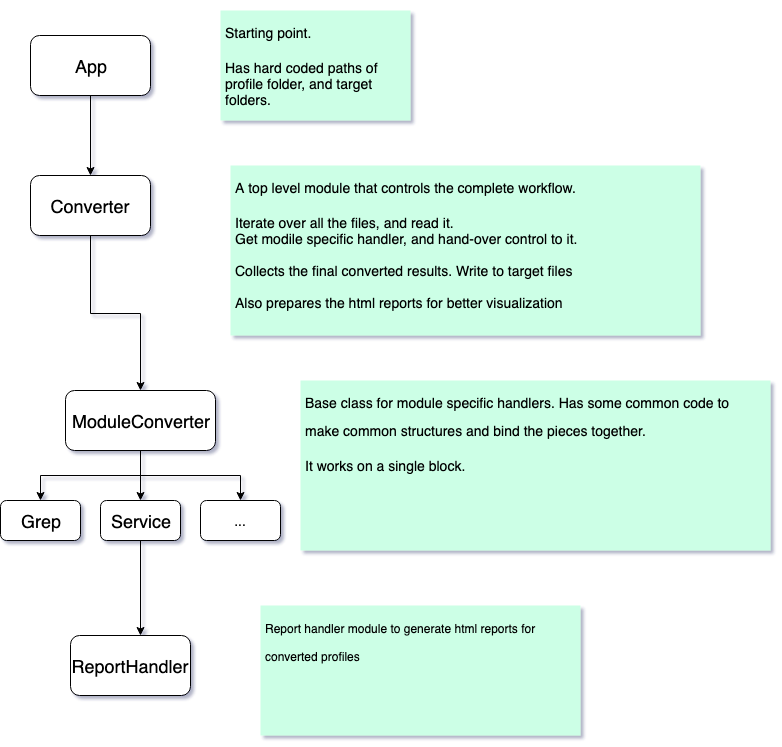

# For converting Nova-v1 audit profiles to Nova-v2 (Audit) profiles.
We wrote a new Audit module with some new features and enhancements. We introduced a new syntax for writing profiles.

This converter is to convert old syntax profiles to newer one.

## Architecture
A small architecture diagram to understand this code.



## How to run
Currently, it is not having any command line options. 

Open app.py
There are three variables which you need to change

```
folder (The source folder where old profiles are placed)
report_folder (Report folder where html report will be written)
dest_profile_folder (Target folder where converted profiles will be written)
```
